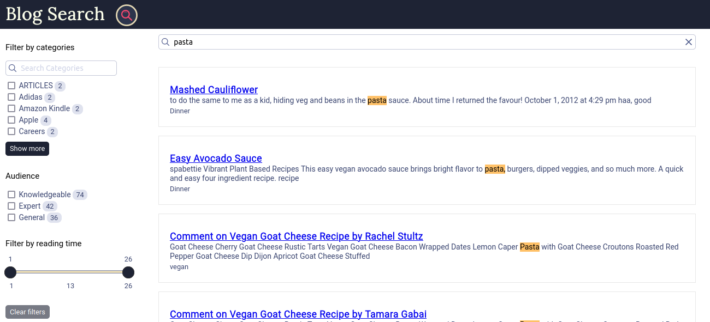

### Demo for Blog Search

A search for blogs built using Typesense engine as backend and Typesense-Instantsearch-adapter for UI.

---

Each document for the search engine collection should follow the below Schema:

```
{
  { name: 'title', type: 'string' },
  { name: 'category', type: 'string' },
  { name: 'url', type: 'string' },
  { name: 'description', type: 'string' },
  { name: 'text', type: 'string' },
  { name: 'read_time', type: 'int32' },
  { name: 'aud', type: 'string' }
}
```

1. `git clone https://github.com/anooj-gandham/typesense-instantsearch-demo`
2. `npm i`
3. `npm run typesenseServer`
4. `node createSchema.js`
5. `node addDocuments <path of file with records>`
6. `npm start`

---

Additionally, the number of documents in a collection can be viewed using:

`node checkDocuments.js`

A collection can be deleted using:

`node deleteSchema.js <collection name>`

The UI will be running on [http://localhost:3000](http://localhost:3000)

**Homescreen** 

---

**Search Screen** 

---

> Happy Searching
